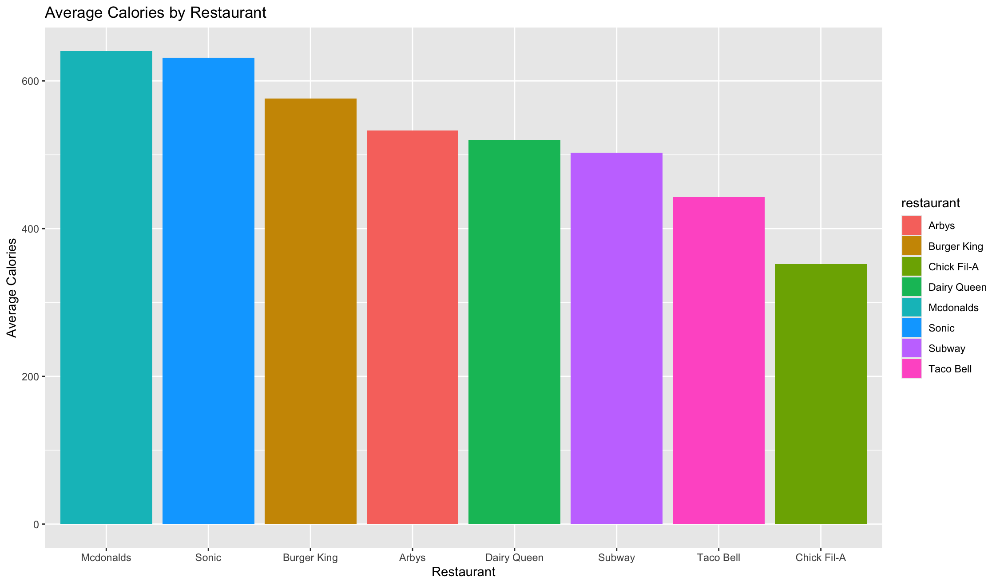
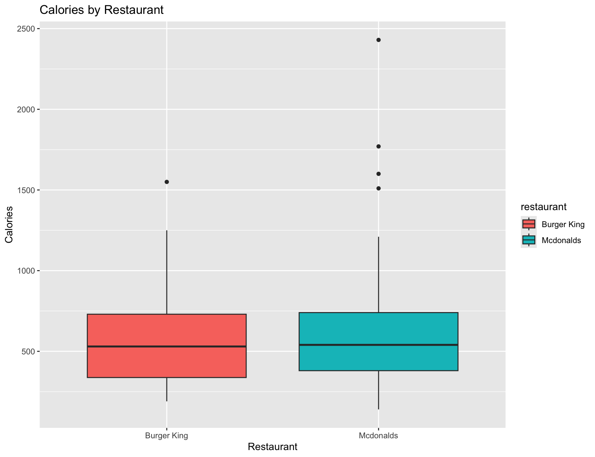
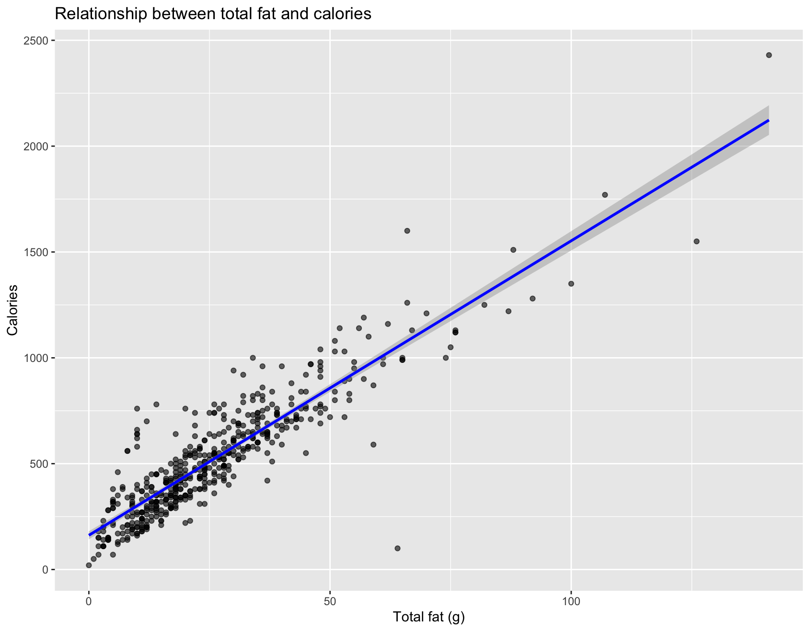

# 🍔 Fast Food Nutritional Analysis Using R

## 📊 Project Overview

This project uses R to explore and analyze the nutritional profiles of fast food menu items from several popular restaurants using R. It demonstrates data cleaning, transformation, visualization, and statistical analysis techniques.

Key questions explored include:

- Do McDonald’s’ meals have higher calories than Burger King’s meals?
- Does total fat content predict calorie levels?
- Which restaurant serves the highest average-calorie meals?

## 📁 Dataset Description

The dataset used is [`fastfood.csv`](./fastfood.csv), sourced from [Kaggle](https://www.kaggle.com/datasets/ulrikthygepedersen/fastfood-nutrition). It contains 515 food items from multiple fast food chains, along with nutritional data such as calories, fat, sugar, sodium, and protein.

**Key Variables:**
- `restaurant`: Name of the restaurant
- `item`: Menu item name
- `calories`: Total calories
- `total_fat`: Total fat (grams)
- `sodium`, `protein`, `sugar`, `fiber`, etc.

## 🔄 Data Ingestion & Cleaning

The dataset was imported into R using:

`read.csv("fastfood.csv")`

### Cleaning Steps

- ✅ Checked for missing values using `colSums(is.na(...))`
- 🧹 Removed columns with excessive missing data (over 200 missing values): `vit_a`, `vit_c`, and `calcium`
- 🧼 Filtered out 13 rows with missing values in `fiber` or `protein`
- 🚫 Removed duplicates using `duplicated()` and `!duplicated()`

These steps ensured the dataset was clean and ready for analysis.

## 🧰 Data Manipulation

We performed data manipulation using the `dplyr` package to prepare the data for analysis.

### ✅ Operations Performed:
- **Filtering:** Selected low-calorie items with `calories < 500` to identify healthier options.
- **Grouped Summary:** Calculated average calories per restaurant using `group_by()` and `summarise()`.

These operations helped us explore calorie trends and focus on meaningful comparisons across restaurants.

## 📊 Statistical Analysis

### 📌 Descriptive Statistics

We began our statistical analysis by examining measures of central tendency and variability in the dataset:

- **Mean Calories Across All Meals:**  
  The average number of calories across all fast food items was approximately **610.45 kcal**.

- **Standard Deviation of Total Fat:**  
  The standard deviation for total fat content was **13.88g**, indicating moderate variability in fat content across menu items.

To explore how calorie content varied between restaurants, we calculated the average calories per restaurant and visualized the results using a bar plot:

From the bar plot, we can see that **McDonald's** has the highest average calorie count, while **Chick-fil-A** offers the lowest on average. This suggests that not all fast food is nutritionally equal, and some chains consistently provide more calorie-dense meals than others.

### 🧪 Hypothesis Testing: One-Tailed T-Test

To determine whether **McDonald's** meals are significantly higher in calories than **Burger King's**, we conducted a one-tailed independent t-test.

#### Hypotheses:
- **Null Hypothesis (H₀):** There is no difference in mean calories between McDonald’s and Burger King.
- **Alternative Hypothesis (H₁):** McDonald’s meals have higher mean calories than Burger King.

#### Result:
- **p-value = 0.164**  
- Since the p-value is greater than 0.05, we **fail to reject the null hypothesis**. There is insufficient evidence to conclude that McDonald's meals have higher average calories than Burger King's.

#### Supporting Visualization:

The boxplot compares calorie distributions between McDonald’s and Burger King. While McDonald's shows a slightly higher median and greater spread, the overlap and statistical results indicate the difference is not significant.

### 📉 Linear Regression

To assess the relationship between fat content and calorie count, we built a simple linear regression model with **total fat** as the predictor variable and **calories** as the outcome variable.

#### Model Summary

- **Model Formula:**  
  `Calories = 161.74 + 13.91 × Total Fat`

- **Interpretation:**  
  For each additional gram of total fat in a fast food item, the number of calories increases by approximately **13.91 kcal**, on average.

- **Statistical Significance:**
  - **p-value:** < 0.001 (highly significant)
  - **R-squared:** 0.805  
    This means that 80.5% of the variation in calories across items can be explained by their total fat content.

The linear relationship is visualized in the plot below, showing how calories tend to rise with increasing fat content.

## ✅ Conclusion

This project explored the nutritional content of fast food items from several major chains using R.

Key insights include:

- **McDonald's and Burger King** meals have similar average calorie content. The one-tailed t-test did **not** find statistically significant evidence that McDonald's meals have higher calories on average than Burger King's.
- The **strong linear relationship** between **total_fat** and **calories** suggests that fat content is a major contributor to calorie count. Specifically, each additional gram of fat adds nearly **14 calories**.
- Restaurants like **Sonic** and **McDonald's** tend to offer higher-calorie meals on average, while **Chick-fil-A** stands out with lower average calories.

By applying data cleaning, manipulation, statistical testing, and visualization, this analysis demonstrates how **R** can be used to extract meaningful insights from real-world nutritional data.
